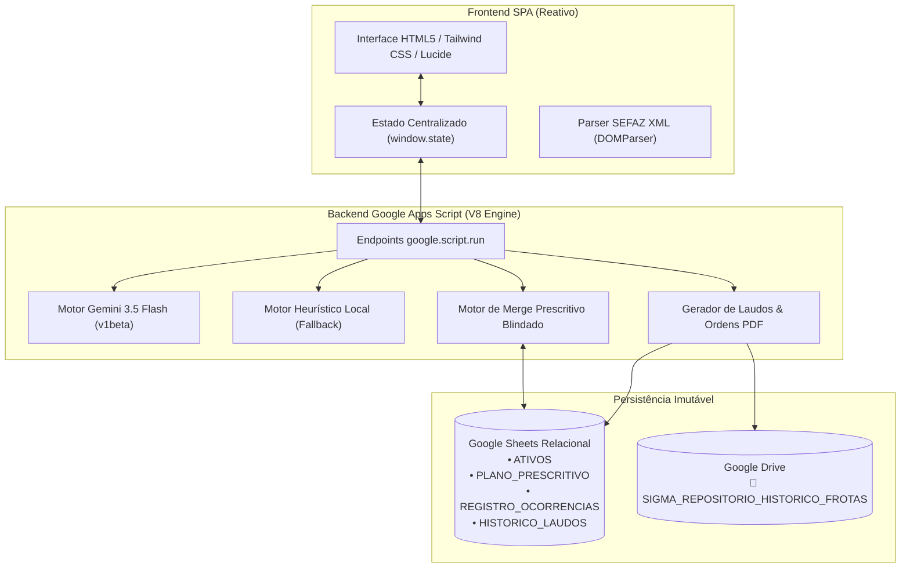

<div align="center">

# 🚗 SIGMA CMMS v1.0
### Sistema Inteligente de Gestão de Manutenções Automotivas & Triagem B2B

[](https://sigma.infinitussistemas.com.br)
[](https://developers.google.com/apps-script)
[](https://ai.google.dev/)
[](https://www.google.com/sheets/about/)
[](https://www.google.com/drive/)

**URL Oficial de Produção:** [https://sigma.infinitussistemas.com.br](https://sigma.infinitussistemas.com.br)  
**Autoria Intelectual & Concepção:** ORVATE, Carlos A.  
**Propriedade Comercial & Industrial:** Infinitus Sistemas Inteligentes Ltda (CNPJ: 09.371.580/0001-06)

---

</div>

## 📌 1. Visão Geral e Proposta de Valor

O **SIGMA (Sistema Inteligente de Gestão de Manutenções Automotivas)** é uma plataforma avançada de CMMS (*Computerized Maintenance Management System*) e triagem mecânica B2B desenvolvida para conectar o condutor, a oficina mecânica e os gestores de frota em um ambiente técnico unificado e transparente.

### O Problema Resolvido:
* **Assimetria de Informações:** Distanciamento técnico entre as queixas do proprietário e o diagnóstico mecânico real.
* **Falta de Histórico Causal:** Inexistência de um registro cronológico confiável de peças e intervenções já quitadas.
* **Perda de Receitas Preventivas:** Ausência de alertas de manutenção preventiva programada para oficinas (*upsell*).
* **Risco de Falhas Catastróficas:** Negligência em subsistemas críticos (câmbio automático, arrefecimento e distribuição).

### A Solução SIGMA:
* **Triagem Mecânica via IA (Gemini 3.5 Flash):** Converte queixas em linguagem natural em árvores causais com probabilidades e roteiros de testes de bancada/elevador.
* **Auditoria de Marco Zero & Score de Saúde:** Monitoramento dinâmico (0 a 100) do ativo veicular baseado em regime de uso (Severo Urbano vs. Rodoviário).
* **Ordem de Inspeção Técnica (PDF):** Prancha física de oficina com isolamento de queixa, checklist `[   ]` e gatilhos de venda preventiva nos próximos 500 km.
* **Ingestão Multimodal (SEFAZ XML & OCR):** Parser automatizado de notas fiscais eletrônicas brasileiras (NF-e modelo 55) e faturas de oficina.

---

## 🏗️ 2. Arquitetura Tecnológica e Stack

O SIGMA opera sobre uma arquitetura híbrida em nuvem serverless no ecossistema Google Workspace:



| Componente | Tecnologia | Função Principal |
| :--- | :--- | :--- |
| **Frontend** | HTML5, CSS3 Tailwind-like, Vanilla JS, Lucide Icons | Single Page Application responsiva para desktop e mobile com Gauge dinâmico SVG. |
| **Backend** | Google Apps Script (Runtime V8) | Microsserviços assíncronos, processamento documental e integração de APIs. |
| **Banco de Dados** | Google Sheets Relacional | Estrutura em 4 tabelas relacionais (`ATIVOS`, `PLANO_PRESCRITIVO`, `REGISTRO_OCORRENCIAS`, `HISTORICO_LAUDOS`). |
| **Repositório de Arquivos** | Google Drive | Armazenamento imutável de PDFs na pasta `SIGMA_REPOSITORIO_HISTORICO_FROTAS`. |
| **Inteligência Artificial** | Google Gemini 3.5 Flash (`v1beta`) | Triagem preditiva, sugestão de TSBs e calibração de planos prescritivos. |

---

## ⚡ 3. Principais Módulos e Recursos

### 3.1. Triagem Preliminar IA & Árvore Causal
* Processa o sintoma descrito pelo condutor cruzando com a motorização, transmissão e histórico de notas fiscais do veículo.
* Retorna hipóteses graduadas em percentuais (ex: *80% Coxim Hidráulico, 65% Bieletas, 40% Eletroválvula AL4*) com instruções físicas de elevador (*smoke test*, inspeção visual, multímetro).

### 3.2. Ordem de Investigação Técnica (PDF para Chão de Oficina)
* Layout limpo em prancha de oficina, otimizado para prancheta e livre de emojis para garantir compatibilidade de impressão.
* **Isolamento de Responsabilidade:** Queixa do condutor identificada como `[ RELATO LITERAL ]`.
* **Gatilhos B2B de Upsell:** Lista de itens críticos e revisões preventivas a vencer nos próximos **500 km**.
* **Nota Jurídica de Isenção ao Reparador:** Respaldo pericial consultivo sob a Lei 12.965/2014.

### 3.3. Ingestão Multimodal & Leitura de Notas Fiscais
* **SEFAZ XML (NF-e):** Ingestão com 1 clique de arquivos XML de notas fiscais, desmembrando peças, serviços, valores e CNPJ emitente.
* **OCR Inteligente:** Leitura de imagens/fotos de ordens de serviço antigas via visão computacional do Gemini.
* **IA Autônoma (OEM & TSBs):** Descoberta automática de boletins técnicos da montadora e subsistemas críticos para qualquer veículo cadastrado.

### 3.4. Motor de Merge Prescritivo Blindado
* **Proteção do Mantenedor Especialista:** Preserva integralmente as intervenções manuais cadastradas por especialistas (`MANTENEDOR_ESPECIALISTA`), impedindo que a IA sobrescreva diretrizes já homologadas.
* **Zero Duplicatas:** O front-end prioriza a leitura direta do banco de dados consolidado, eliminando sobreposições visuais.

---

## 📊 4. Estrutura do Banco de Dados (Google Sheets)

A persistência do sistema é estruturada em 4 abas relacionais na planilha mestre:

1. **`ATIVOS`**: Cadastro mestre de veículos da frota (`ID`, `Marca`, `Modelo`, `AnoFabricacao`, `AnoModelo`, `Motorizacao`, `Combustivel`, `Placa`, `Chassi`, `KMInicial`, `KMAtual`, `StatusAtivo`, `RegimeUso`, `TipoTransmissao`, `TipoDistribuicao`).
2. **`PLANO_PRESCRITIVO`**: Diretrizes de manutenção programada por ativo (`ID`, `VeiculoID`, `Intervencao`, `Subsistema`, `Tipo`, `IntervaloKM`, `IntervaloMeses`, `EspecificacaoTecnica`, `OrigemFonte`, `TextoPrecaucao`, `DataAtualizacao`).
3. **`REGISTRO_OCORRENCIAS`**: Histórico auditável de manutenções realizadas (`ID`, `VeiculoID`, `Placa`, `Data`, `KM`, `TipoManutencao`, `Subsistema`, `DescricaoServico`, `ValorTotal`, `OficinaNome`, `OficinaCNPJ`, `OficinaCidade`, `NumeroOS`, `ComprovanteUrl`).
4. **`HISTORICO_LAUDOS`**: Índice cronológico de PDFs arquivados no Drive (`TIMESTAMP`, `PLACA_ATIVO`, `TIPO_DOCUMENTO`, `USUARIO_RESPONSAVEL`, `RESUMO_DIAGNOSTICO`, `LINK_DIRETO_DRIVE`).

---

## 🚀 5. Instalação e Deploy

### Pré-requisitos
* Node.js v18+ instalado.
* Conta Google com acesso ao Google Drive e Google Sheets.
* Chave de API ativa do Google AI Studio ([Google Gemini API Key](https://aistudio.google.com/)).

### Passo a Passo via Google Clasp

1. **Clone o repositório:**
   ```bash
   git clone https://github.com/carlosorvate-tech/sigma.git
   cd sigma
   ```

2. **Instale as dependências e configure o Clasp:**
   ```bash
   npm install -g @google/clasp
   clasp login
   ```

3. **Vincule o projeto ao seu Apps Script:**
   ```bash
   clasp clone <SEU_SCRIPT_ID>
   ```

4. **Configure as Propriedades do Script no Google Apps Script:**
   * `GEMINI_API_KEY`: Sua chave de API do Gemini.
   * `SPREADSHEET_ID`: O ID da sua Planilha Google mestre.

5. **Envie os arquivos e publique a versão:**
   ```bash
   clasp push --force
   clasp deploy -d "SIGMA v1.0 Production Release"
   ```

---

## 📜 6. Governança e Propriedade Intelectual

* **Autoria Intelectual & Concepção Arquitetônica:** `ORVATE, Carlos A.`
* **Titularidade Comercial, Marca e Direitos:** `Infinitus Sistemas Inteligentes Ltda` (CNPJ: `09.371.580/0001-06`).
* **Conformidade Legal:** Desenvolvido em estrita conformidade com a **Lei 12.965/2014 (Marco Civil da Internet)** e normas de proteção de dados (LGPD - Lei 13.709/2018).

---

<div align="center">

Desenvolvido com excelência técnica por **Infinitus Sistemas Inteligentes Ltda**  
*Transformando dados automotivos em confiabilidade operacional.*

</div>
