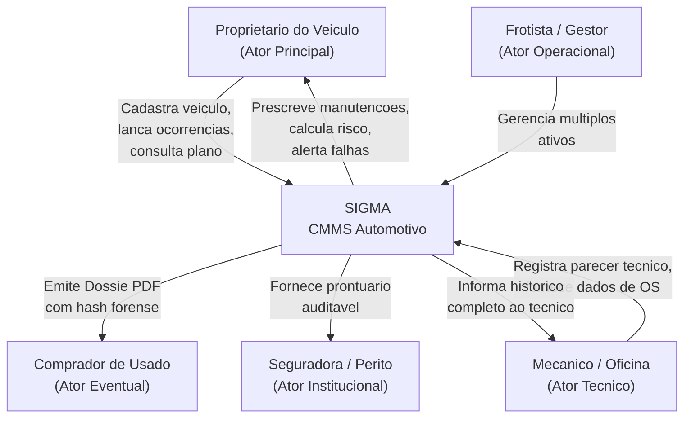

<![CDATA[

# σ SIGMA

### Sistema Inteligente para Gestão de Manutenções Automotivas

**Versão 1.0 — Apresentação Institucional**

---

*Infinitus Sistemas Inteligentes Ltda*
*CNPJ: 09.371.580/0001-06*

*Autoria Intelectual & Concepção: ORVATE, Carlos A.*

---

---

## 1. O Problema

### 1.1. A Realidade do Proprietário de Veículo no Brasil

O Brasil possui uma frota de mais de **115 milhões de veículos** (DENATRAN, 2025). Para a esmagadora maioria desses proprietários, a gestão de manutenção do veículo é feita de uma única maneira: **memória e sorte**.

> *"Quando foi a última troca de óleo? Qual a quilometragem? Já trocou a correia dentada? Quanto já gastei nesse carro?"*

Essas perguntas, aparentemente simples, revelam uma lacuna crítica: **não existe, para o motorista comum ou pequeno frotista, um sistema acessível, contínuo e inteligente que registre, analise e prescreva manutenções veiculares** com base em dados reais — e não em palpites.

### 1.2. As Consequências da Gestão Inexistente

A ausência de controle estruturado gera três categorias de dano:

| Categoria | Consequência Direta | Impacto |
|---|---|---|
| **Patrimonial** | Falhas destrutivas evitáveis (motor fundido, câmbio travado, superaquecimento) | Perda de R$ 5.000 a R$ 25.000+ por evento |
| **Segurança** | Componentes de frenagem, direção ou suspensão degradados sem aviso | Risco de acidente fatal |
| **Financeira** | Impossibilidade de comprovar histórico em revenda; pagamento duplicado por serviços | Desvalorização de 15-30% do ativo |

### 1.3. O Público Afetado

- **Proprietários individuais** que dependem do veículo para trabalho e mobilidade.
- **Pequenos frotistas** (2 a 20 veículos) sem acesso a sistemas ERP/CMMS industriais.
- **Motoristas de aplicativo** que rodam altas quilometragens em regime severo.
- **Famílias** que compartilham veículos e perdem rastreabilidade de quem fez o quê.
- **Compradores de veículos usados** que não têm como auditar o histórico real.

### 1.4. O Propósito do SIGMA

O **SIGMA** foi concebido para eliminar essa lacuna com uma premissa radical:

> **Todo veículo merece um prontuário técnico — tão rigoroso quanto um prontuário médico.**

O sistema transforma dados dispersos (notas fiscais, ordens de serviço, manuais do fabricante, memória do proprietário) em **inteligência prescritiva**, entregando ao dono do veículo o controle total sobre:

1. 🛡️ **Preservação do Ativo** — saber exatamente o estado de cada subsistema.
2. ⚠️ **Prevenção de Falhas Críticas** — alertas antecipados de risco destrutivo.
3. 📊 **Auditoria Financeira & Causal** — quanto, quando, onde e por quê cada real foi investido.

---

## 2. Telas do Aplicativo: Função, Detalhes e Resultados

### 2.1. Tela de Aceite de Termos de Uso (Clickwrap de Onboarding)

**Quando aparece:** Exclusivamente no primeiro acesso do usuário ao sistema.

**Função:**
Apresenta os Termos de Uso, Governança e Limites de Responsabilidade Técnica do SIGMA, estruturados em 4 blocos jurídicos: (1) Finalidade Prescritiva e CMMS, (2) Caráter Consultivo e Não Pericial, (3) Responsabilidade pela Veracidade dos Dados Declarados, (4) Propriedade Intelectual e Direitos Comerciais.

**Detalhes técnicos:**
- Verificação via `localStorage` (chave `sigma_termo_aceite_v1`).
- Após o aceite, o sistema nunca mais exibe o modal automaticamente.
- O usuário pode reler os termos a qualquer momento via link no rodapé institucional.

**Resultado esperado:** Conformidade legal (Lei 12.965/2014 — Marco Civil da Internet) e transparência total sobre a natureza consultiva do sistema.

---

### 2.2. Banner Hero & Painel de Identidade do Ativo

**Localização:** Topo da área principal, sempre visível.

**Função:**
Área de contexto permanente que identifica instantaneamente qual veículo está sendo gerenciado, seu estado operacional e seu Score de Saúde em tempo real.

**Detalhes:**
- **Título do Veículo**: Marca, Modelo, Ano (ex: *Citroën C4 Pallas 2009/2009*).
- **Badges Técnicos**: Placa oficial, tipo de combustível, tipo de câmbio, regime de uso.
- **Odômetro Editável**: Quilometragem atual com botão de atualização imediata.
- **Oficina Base**: Última oficina registrada no histórico.
- **Gauge Circular de Saúde**: Score de 0 a 100 com código de cores (verde ≥ 80, âmbar ≥ 55, vermelho < 55). Calculado algoritmicamente com base no plano prescritivo vs. histórico real.
- **Semáforo de Alertas**: Contadores numéricos para itens *Em Dia*, *Crítico* e *Atenção*.
- **Widget de Telemetria**: Indicadores `MOTOR ATIVO`, `100% AUDITABILIDADE` e `MARCO ZERO`.

**Resultado esperado:** O usuário sabe, em menos de 2 segundos, qual é a "temperatura" geral do veículo — sem precisar ler nenhuma tabela.

---

### 2.3. Tela: Plano Mestre Prescritivo & Protocolo do Marco Zero

**Localização:** Primeira aba do sistema (aba padrão ao abrir o app).

**Função:**
É o núcleo de inteligência do SIGMA. Exibe todas as **diretrizes de manutenção** que o veículo precisa cumprir, classificadas por risco, com prazos em quilômetros e meses.

**Detalhes:**
- Cada diretriz é um card expansível contendo:
  - **Nome da intervenção** (ex: *"Troca de Óleo do Motor e Filtro de Óleo"*).
  - **Subsistema** (Motor, Trem de Força, Arrefecimento, Freios, etc.).
  - **Intervalo prescrito** em KM e meses.
  - **Especificação técnica** (tipo de óleo, marca, norma).
  - **Classificação de risco** (`CRÍTICO DESTRUTIVO`, `INSPECIONÁVEL`, `EM DIA`).
  - **Diretiva de precaução técnica** — texto descritivo do risco caso a manutenção não seja realizada.
  - **Ações**: Botão para registrar Parecer Técnico de inspeção ou criar Ocorrência de Marco Zero.
- **Protocolo do Marco Zero**: Quando o veículo é cadastrado pela primeira vez, todas as diretrizes começam em estado `CRÍTICO SEM HISTÓRICO` — significando que o sistema não pode garantir que aquela manutenção foi feita. O proprietário deve então "zerar" cada item com evidência (data, KM, oficina).
- **Dois botões de ação no cabeçalho**:
  - `[ + Nova Diretriz de Manutenção ]` — cadastro manual rápido.
  - `[ Recalcular / Ingerir Fontes ]` — ingestão multimodal (IA + OCR + texto + URL).

**Resultado esperado:** O proprietário enxerga, de forma cristalina, tudo que precisa ser feito no veículo, ordenado por urgência — e pode agir diretamente a partir de cada card.

---

### 2.4. Tela: Histórico de Ocorrências e Serviços

**Localização:** Segunda aba do sistema.

**Função:**
Registro cronológico completo de todos os eventos de manutenção realizados no veículo: preventivas, corretivas, emergenciais, inspeções.

**Detalhes:**
- Tabela com colunas: Data/Doc, Placa, KM, Tipo, Composição de Peças & Mão de Obra, Valor Total, Ações.
- Cada linha representa uma Ordem de Serviço (OS) completa.
- A composição de peças é exibida item a item, com tipo (Peça, Mão de Obra, Óleo/Fluido, Retífica, Insumo) e valor unitário.
- Suporte à **deduplicação automática** de registros idênticos (mesmo serviço, data e valor), prevenindo lançamentos duplicados por importação.
- Ações por registro: **Editar** (reabrir formulário preenchido) e **Excluir** (com confirmação).

**Resultado esperado:** O veículo ganha um "extrato bancário" de toda intervenção mecânica já realizada — prova documental para revenda, garantia ou disputa.

---

### 2.5. Tela: Dashboard Executivo & Pareto

**Localização:** Terceira aba do sistema.

**Função:**
Visão analítica e financeira consolidada sobre os investimentos realizados no veículo.

**Detalhes:**
- **Gráfico de Pareto** (barras + linha acumulada): identifica visualmente quais categorias de manutenção concentram a maior parte dos gastos (princípio 80/20).
- **Lista de Custos por Categoria**: ranking de investimento por subsistema (Motor, Freios, Suspensão, etc.) com barras de progresso proporcionais.
- **Investimento Total Acumulado**: somatório geral de todos os registros, exibido em destaque.

**Resultado esperado:** O proprietário identifica em 5 segundos *onde está indo seu dinheiro* — se o motor consome 60% dos gastos, é sinal de investigação. Permite decisões estratégicas: reparar ou substituir o ativo.

---

### 2.6. Modal: Nova Ocorrência de Manutenção

**Acionamento:** Botão "Nova Ocorrência" na sidebar ou topbar.

**Função:**
Formulário completo para registro de intervenções mecânicas com suporte a múltiplos itens por OS.

**Detalhes:**
- Campos: Data, KM, Tipo (Preventiva, Corretiva, Emergencial, Inspeção), Oficina/Mecânico, CNPJ da Oficina, Cidade, Nº da OS.
- Tabela dinâmica de itens: cada linha contém Tipo do item (Peça, Mão de Obra, Óleo/Fluido, Retífica, Insumo), Descrição, Subsistema e Valor Unitário.
- Cálculo automático do valor total.
- Suporte para adicionar e remover linhas livremente.

**Resultado esperado:** O usuário registra qualquer evento mecânico em menos de 2 minutos, com rastreabilidade granular de cada real investido.

---

### 2.7. Modal: Nova Diretriz Prescritiva (Cadastro Manual)

**Acionamento:** Botão `[ + Nova Diretriz de Manutenção ]` no Plano Prescritivo.

**Função:**
Permite ao usuário ou técnico inserir manualmente uma diretriz que não consta no plano do fabricante (ex: recomendação de mecânico, recall, etc.).

**Detalhes:**
- Campos: Nome da Intervenção, Subsistema, Tipo (Preventiva/Corretiva/Inspeção), Intervalo em KM, Intervalo em Meses, Especificação Técnica, Origem/Fonte e Texto de Precaução.
- Merge inteligente por chave composta (subsistema + intervenção): se já existir, atualiza ao invés de duplicar.

**Resultado esperado:** O Plano Prescritivo se torna vivo e editável — não é uma lista estática, mas um documento que evolui com o veículo.

---

### 2.8. Modal: Ingestão Multimodal & Recálculo (Motor de IA)

**Acionamento:** Botão `[ Recalcular / Ingerir Fontes ]` no Plano Prescritivo.

**Função:**
Motor de processamento que aceita múltiplas fontes de dados para gerar ou complementar o Plano Prescritivo.

**Detalhes:**
- **4 modos de ingestão**: Automático (plano OEM por regime de uso), Upload de Arquivo (PDF/imagem de manual ou OS), URL (link para manual online) e Texto Livre (colagem de recomendações).
- **Seleção de Regime de Uso**: Normal, Severo Urbano, Severo Estrada, Frota, Taxi.
- **Estratégia de Merge**: Substituição total ou Merge Aditivo (preserva itens manuais, adiciona novos).

**Resultado esperado:** O sistema absorve conhecimento de qualquer fonte — do PDF do manual do fabricante ao bilhete do mecânico — e transforma em diretrizes prescritivas estruturadas.

---

### 2.9. Modal: Cadastro e Edição de Veículo

**Acionamento:** Sidebar → "Cadastrar Novo Veículo" ou "Editar Veículo Ativo".

**Função:**
CRUD completo do ativo veicular.

**Detalhes:**
- Campos: Marca, Modelo, Ano Fabricação, Ano Modelo, Placa (Chassi), Motorização, Combustível, Transmissão, Regime de Uso e KM Atual.
- Modo edição: preenchimento automático dos campos com dados do veículo ativo.
- Ação destrutiva: botão de exclusão do veículo (com confirmação) — remove o ativo e todos os registros associados.

**Resultado esperado:** O sistema suporta múltiplos veículos com alternância instantânea via seletor no topo do painel.

---

### 2.10. Modal: Parecer Técnico de Inspeção

**Acionamento:** Botão "Registrar Parecer" em cada diretriz prescritiva.

**Função:**
Permite que um mecânico ou técnico registre um laudo de inspeção presencial sobre um item prescritivo — confirmando ou descartando a necessidade de intervenção.

**Detalhes:**
- Campos: Item Prescrevido (pré-preenchido), Data da Inspeção, KM, Oficina/Mecânico Responsável, Texto do Parecer.
- Nota técnica legal (micro-disclaimer): *"Parecer algorítmico consultivo baseado em histórico e sintomas declarados. Não dispensa inspeção física presencial."*

**Resultado esperado:** Cria-se a ponte entre o prescrito (algoritmo) e o realizado (humano) — evidência documental de que o item foi inspecionado por profissional habilitado.

---

### 2.11. Dossiê Veicular em PDF (Auditoria Forense)

**Acionamento:** Sidebar → "Emitir Dossiê PDF".

**Função:**
Geração instantânea de documento técnico consolidado em formato PDF para impressão, envio ou arquivamento.

**Detalhes:**
- **Seção 1**: Quadro de Gestão de Riscos — todos os itens prescritivos com classificação de risco e diretiva de precaução.
- **Seção 2**: Histórico de Manutenções — todos os eventos com composição detalhada de peças e valores.
- **Rodapé**: Declaração dos 3 Pilares SIGMA em todas as páginas.
- **Box Forense Final**: Hash SHA-256 de integridade documental, data/hora de emissão, e selo de autenticidade institucional da Infinitus, em conformidade com a Lei 12.965/2014.

**Resultado esperado:** O proprietário possui um documento com validade rastreável — útil para revenda, seguro, perícia, garantia judicial ou simplesmente para guardar no porta-luvas digital.

---

### 2.12. Sidebar & Navegação

**Função:**
Centro de comando com navegação entre módulos, ações de gestão de ativos e seletor de veículo.

**Detalhes:**
- **Desktop**: Sidebar fixa lateral com seções: Identidade do produto, Seletor de Veículo, Botão Nova Ocorrência, Navegação Operacional (3 abas), Ações de Gestão de Ativos (Cadastrar, Editar, Emitir Dossiê), e Rodapé de versão com indicador de status operacional.
- **Mobile**: Topbar compacta + Drawer lateral deslizante + Bottom Navigation Bar fixa com 4 ícones.

**Resultado esperado:** Navegação fluida e responsiva em qualquer dispositivo — do desktop do escritório ao celular no pátio da oficina.

---

## 3. Atores do Sistema, Relações e Problemas Resolvidos

### 3.1. Mapa de Atores

### 3.2. Detalhamento por Ator

#### Proprietário do Veículo (Ator Principal)

**Problema:** Não sabe o que já fez, o que precisa fazer, quanto já gastou, e não tem como provar nada disso.

**Como o SIGMA resolve:**
- Centraliza todo o histórico em um prontuário digital único.
- Prescreve automaticamente o que precisa ser feito, com prazos em KM e meses.
- Calcula um Score de Saúde visual e imediato.
- Emite Dossiê PDF com rastreabilidade forense para qualquer finalidade.

---

#### Mecânico / Oficina (Ator Técnico)

**Problema:** Recebe veículos sem histórico, não sabe o que já foi feito, gasta tempo em diagnóstico e às vezes recomenda trocas desnecessárias (ou deixa de recomendar as necessárias).

**Como o SIGMA resolve:**
- Apresenta o Plano Prescritivo completo ao mecânico antes da intervenção.
- Permite que o mecânico registre Pareceres Técnicos de inspeção, criando prova documental de sua avaliação.
- O histórico completo de peças, marcas e intervalos evita retrabalho e redundância.

---

#### Comprador de Veículo Usado (Ator Eventual)

**Problema:** Não tem como saber se o carro foi bem cuidado. Depende da palavra do vendedor.

**Como o SIGMA resolve:**
- O Dossiê PDF funciona como um *Carfax brasileiro* particular — registro granular de cada intervenção, com datas, KMs, oficinas, valores e hash de integridade documental.
- O Score de Saúde fornece um indicador objetivo e algorítmico do estado do veículo.

---

#### Seguradora / Perito (Ator Institucional)

**Problema:** Em caso de sinistro ou disputa, precisa de evidências documentais de manutenção.

**Como o SIGMA resolve:**
- O Dossiê PDF é emitido com hash SHA-256 de autenticidade, data/hora de emissão e identificação do sistema emissor.
- O histórico prova (ou demonstra a ausência de) manutenções preventivas em componentes críticos.
- Conformidade declarada com a Lei 12.965/2014 (Marco Civil da Internet).

---

#### Frotista / Gestor de Frota (Ator Operacional)

**Problema:** Gerenciar múltiplos veículos com planilhas ou anotações manuais é caótico, propenso a erro e não escala.

**Como o SIGMA resolve:**
- Suporte nativo a múltiplos veículos com alternância instantânea.
- Dashboard com Pareto de custos identifica quais veículos drenam mais recursos.
- Protocolo do Marco Zero permite onboarding rápido de veículos novos na frota.
- Prescrições padronizadas por regime de uso (Normal, Severo Urbano, Frota, Taxi).

---

## 4. Benefícios Além do Problema Principal

O SIGMA foi construído para resolver a ausência de controle de manutenção — mas, ao fazê-lo, produz benefícios colaterais significativos:

### 4.1. Valorização do Ativo na Revenda

Um veículo com Dossiê SIGMA documentado vale mais. O comprador recebe um prontuário completo, com cada real investido rastreado. Isso transforma a negociação: sai do "eu cuidei bem" para o "aqui está a prova".

### 4.2. Redução de Custos por Antecipação

A manutenção preventiva custa, em média, **4 a 8 vezes menos** que a corretiva emergencial. O Plano Prescritivo do SIGMA transforma o proprietário de *reativo* (conserta quando quebra) para *prescritivo* (intervém antes que quebre).

### 4.3. Segurança Pessoal e de Terceiros

Componentes como discos de freio, pastilhas, amortecedores e mangueiras hidráulicas possuem vida útil finita. O SIGMA garante que nenhum desses itens passe despercebido — reduzindo o risco de acidente por falha mecânica.

### 4.4. Memória Institucional do Veículo

Veículos são frequentemente mantidos por oficinas diferentes ao longo da vida. O SIGMA unifica essa memória fragmentada em um único prontuário — independente de qual oficina fez o serviço.

### 4.5. Disciplina Financeira

O Dashboard de Pareto revela padrões ocultos: *"Gastei R$ 8.000 em motor nos últimos 2 anos — talvez seja hora de trocar o carro."* Sem dados, essa decisão é emocional. Com dados, é estratégica.

### 4.6. Governança e Conformidade Legal

O sistema implementa transparência jurídica desde o primeiro acesso (Clickwrap de onboarding) e rastreabilidade forense em cada documento emitido (Hash SHA-256). Isso protege tanto o usuário quanto a empresa desenvolvedora.

### 4.7. Acessibilidade Tecnológica

O SIGMA roda como Web App (PWA-ready), acessível de qualquer navegador em qualquer dispositivo — sem instalação, sem Play Store, sem configuração. O banco de dados é uma Google Sheet — infraestrutura que o usuário já possui gratuitamente.

---

## 5. Ficha Técnica

| Atributo | Valor |
|---|---|
| **Produto** | SIGMA — Sistema Inteligente para Gestão de Manutenções Automotivas |
| **Versão** | 1.0 (Agosto 2026) |
| **Arquitetura** | Google Apps Script (Backend) + HTML5/Tailwind CSS/JS (Frontend) |
| **Banco de Dados** | Google Sheets (Serverless, Zero-Cost) |
| **Hospedagem** | Google Cloud (via Apps Script Web App) |
| **Licença de Uso** | Proprietária — Infinitus Sistemas Inteligentes Ltda |
| **URL de Produção** | https://sigma.infinitussistemas.com.br |
| **Conformidade Legal** | Lei 12.965/2014 (Marco Civil da Internet) |
| **Autoria Intelectual** | ORVATE, Carlos A. |
| **Propriedade Comercial** | Infinitus Sistemas Inteligentes Ltda - CNPJ: 09.371.580/0001-06 |
| **Suporte** | infinitus.sistemas@gmail.com - WhatsApp: (14) 99705-7170 |

---

*Este documento é propriedade intelectual da Infinitus Sistemas Inteligentes Ltda.*
*Reprodução, distribuição ou uso comercial sem autorização prévia é vedado.*

**SIGMA — Porque todo veículo merece um prontuário.**

]]>
